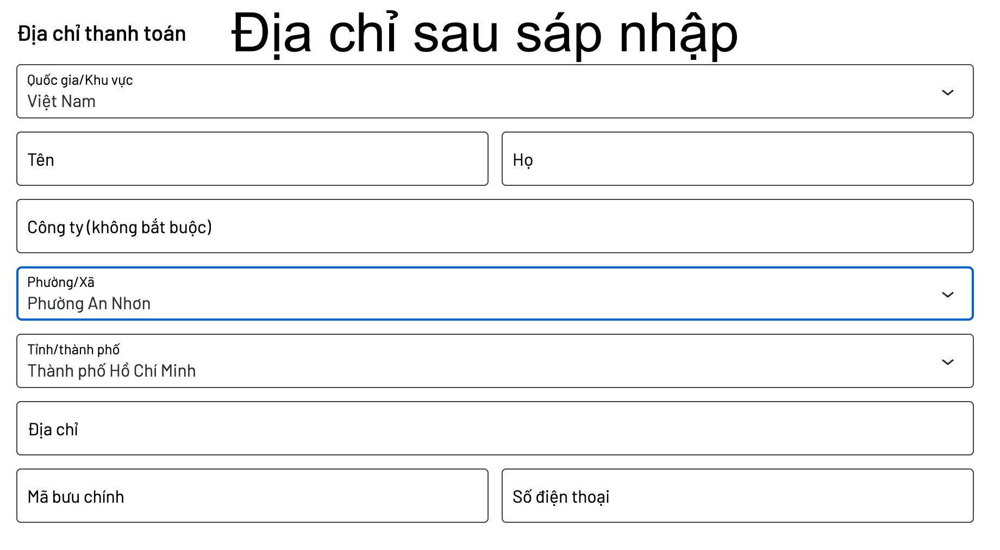
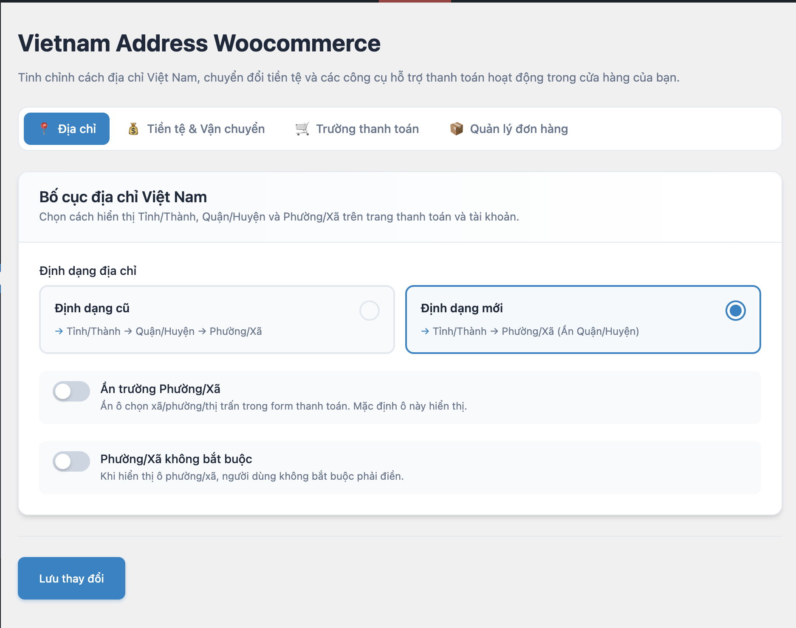

# Vietnam Address Woocommerce

  <a href="README.vi.md">🇻🇳 Tiếng Việt</a>

WooCommerce plugin optimized for the Vietnamese market with Province/City, District, and Ward/Commune selection system.

  
  

---

## Features

- ✅ Dropdown to select **63 Provinces/Cities**
- ✅ Dropdown to select **Districts** based on province
- ✅ Dropdown to select **Wards/Communes** based on district
- ✅ Latest Vietnamese administrative data (2024)
- ✅ Combine "First name & Last name" → "Full name"
- ✅ Add recipient phone field
- ✅ Convert ₫ → VND, PayPal support
- ✅ Shipping rates by zone, weight, order total
- ✅ WooCommerce Blocks Checkout & HPOS compatible

---

## Installation

1. WordPress Admin → Plugins → Add New
2. Search "Vietnam Address Woocommerce"
3. Install → Activate
4. Go to **WooCommerce → Settings → Vietnam Address** to configure

---

## Requirements

| Software | Version |
|----------|---------|
| WordPress | 5.0+ |
| WooCommerce | 8.0+ |
| PHP | 7.4+ |

---

## License

GPLv3 - Copyright (C) 2026 Nguyen Tan Hung

---

  Made with ❤️ in Vietnam

